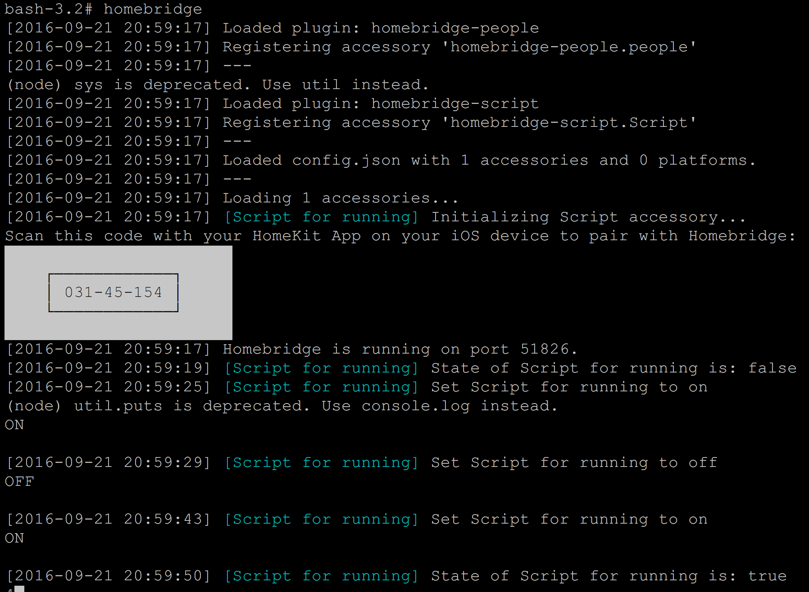

homebridge-script
==============

Run custom script on the HomeBridge platform.

## Installation

1. Install homebridge using: `npm install -g homebridge`
2. Install module: `npm install -g file-exists`
2. Install this plugin using: `npm install -g homebridge-script`
3. Update your configuration file. See `sample-config.json` in this repository for a sample.
4. Copy scripts (*.sh) files to own directory.

For autostart homebridge with OSX copy com.homebridge.startup.plist to /Library/LaunchDaemons

## Configuration

Configuration sample:

```
"accessories": [
	{
              "accessory": "Script",
              "name": "Alarm of bike",
              "on": "~/on.sh",
              "off": "~/off.sh",
              "state": "~/state.sh",
              "fileState": "/Users/olegmalovichko/script.flag",
              "on_value" : "true",
              "exact_match": true
              }
	}
]
```
## Notes
### Using the above configuration as an example:
- The on.sh script executes when turn on the accessory via a homekit app. (insure the on.sh script creates the configured fileState file)
- The off.sh sc ript executes when you turn off the accessory via a homekt app. (insure the off.sh script removes the configured fileState file)
- The state.sh script executes when your homekit app checks for current state.
- The configured fileState file is used as a flag. When the homekit app checks for current state it checks for the existance of this file. If it exists, current state is on. If it does not exist, current state is off.



